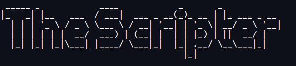
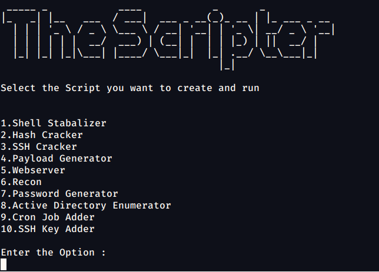
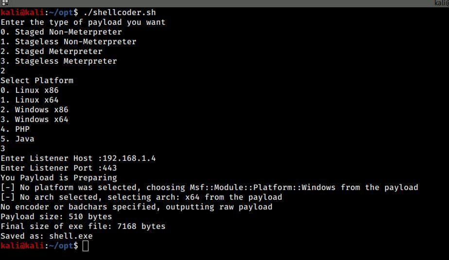

# The_Scripter
The_Scripter is tools for making pentesting easy. It contains lots of automation scripts like hash cracker, ssh_cracker,etc.

  
## INSTALLATION PROCESS
  
 Step 1:     Clone the Script from the given Github Repository
 Command:    git clone https://github.com/manitorpotterk/The_Scripter

Step 2:     cd to the scripter Directory
Command:  cd The_Scripter-main/

Step 3: Permit the script  to run using the chmod command 
Command:  chmod +x  install.sh

Step 4:    Run install.sh  file as a sudo user
Command :    sudo  ./install.sh

Step 5:   Now run the_scripter.sh file
Command :    ./the_scripter.sh

Now you will get command line option to select which script you want to run.

Lets know what these scripts are doing one by one

## 1. Payload Generator
The Payload Generator script will help to generate different types of payloads according to you.
This Script will give options to select the type of payload and the platform for which you needed the payload.

## 2. SSH Cracker
This script will contain code for cracking id_rsa key using John The Ripper.
It will make id_rsa executable and crack it’s password . It will also detect id_rsa is openkey or private key .
This script will also have option for bruteforcing ssh username.

## 3. Hash Cracker
This script will contain code for automatic hash detection. After detecting hash it will run
the cracking script for all the hash types that got detected in parallel.
This script will take a wordlist and hash as basic input. There will be other options as well to
make this script more useful for the user.

## 4. Shell Stabilizer
Stabilize shell uses xautomation, so, it can automatically shift between the shell and
attacker Cmd using ctrl z mouse keys and shortcuts and then it copies the shell $TERM
value and convert our cmd into that like it makes our shell and machine shell environment
same like rows and column size, Cli GUI
By stabilizing the shell we can use tools like vim, vi very swiftly and our shell will behave like
ssh_shell. so, We can use back command and arrow commands and Ctrl + c will not kill the
shell we can also use sudo and su after that on the machine

## 5. Webserver
Recon is a simple script that will scan the whole machine stepwise Like first it will quickly
give results and then will perform a script scan and also start the full scan in the
background. Webserver script will create a web server of your choice for file transferring
and hosting of files. The script uses three different programming languages library to
create a webserver.
1. Python
2. Ruby
3. PHP

## 6. Password Generator
Password Generator is a password generation tool that will print the password of the
desired length you just need to enter the length of the password and 4 passwords will be
printed and you can choose the password which you like the most.

## 7. Juice Shop
Juice shop is a vulnerable web app that is used for security training awareness demos,
CTFs, etc. juice shop has OWASP Top Ten vulnerability along with other security flows in
the real-world applications. The application contains a vast number of hacking challenges
of varying difficulty where the user is supposed to exploit the underlying vulnerabilities.
The hacking process is tracked on a scoreboard.
Apart from the hacker and awareness training use case, pentesting proxies or security
scanners can use Juice Shop as a “guinea pig”-application to check how well their tools cope
with JavaScript-heavy application frontends and REST APIs.

